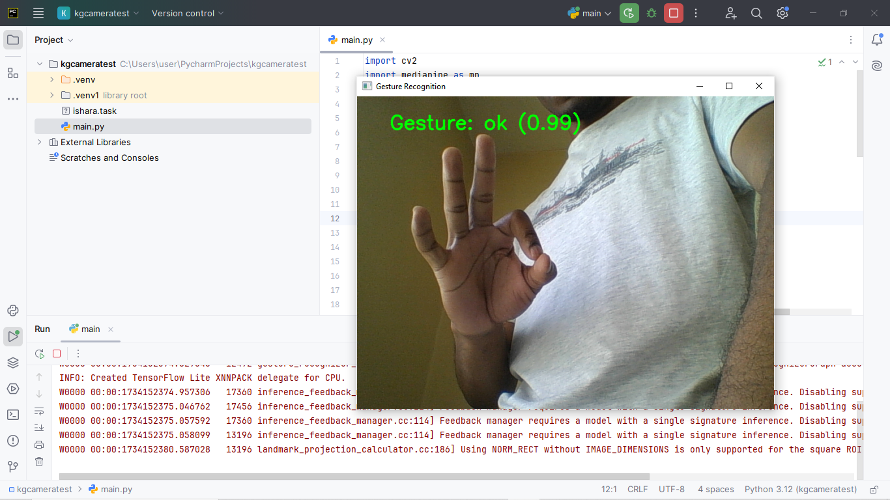

## Documentation
A plug and play script for your customized MediaPipe Models.
This allows testing of the task file with the web camera feed, before the actual integration to the target application.

## Usage
Install the required dependencies:
```commandline
pip install opencv-python

pip install mediapipe
```
Replace the `ishara.task` file, with your custom task file, and update the label at `main.py`.
```commandline
with GestureRecognizer.create_from_model_path('ishara.task') as recognizer:
```
Sample output with labels is as shown in the figure below:
